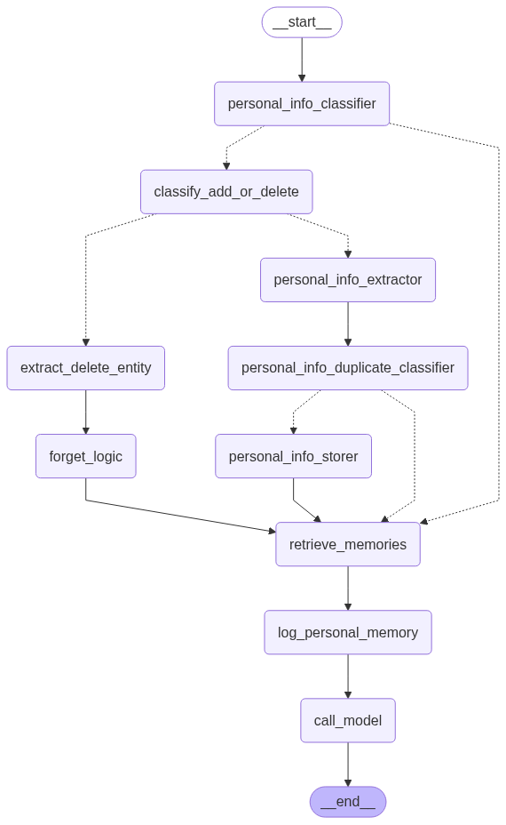

## Long-Term Memory for LLMs

This project implements a long-term memory system for LLM-based agents, enabling them to remember and update user-specific facts over time. Unlike traditional stateless APIs, this system allows an LLM to retain structured information such as user goals, preferences, tools, and plans in a persistent format.

### Problem Addressed

LLMs like OpenAI's models do not inherently remember prior user interactions across sessions. This limits personalization and contextual relevance. Simply storing full chat histories is inefficient and unstructured, and leads to: 
- noisy context windows
- redundancy
- poor retrieval performance.

### Solution Components

- **Structured Memory Storage**: Switched from flat text history to a JSON-based schema, storing memory as attribute-value pairs and also embedding for each preference for retreival tasks.
- **Information Extraction**: Built a custom extractor with few-shot prompting to convert natural language into structured facts (e.g., "Productivity Tools: Magnet").
- **Multi-Entity Handling**: Improved extraction logic to separate multiple values from a single input (e.g., handling "Magnet and Shram" as two entries).
- **Semantic Similarity Matching**: Integrated OpenAI embeddings with cosine similarity to detect and prevent duplicate or semantically similar memory entries.
- **Hybrid Deletion Logic**: Designed a deletion mechanism using similarity thresholding to prune outdated or duplicate entries from memory.
- **Persistent Memory Backend**: Implemented a custom `MemoryStore` class to handle disk-based storage for long-term persistence, replacing in-memory lists.
- **GUI for Inspection**: Developed an interactive GUI using Streamlit to inspect, edit, or delete stored memory in real-time.

The result is a modular, intelligent memory system that makes LLM agents more context-aware, efficient, and user-personalized across sessions.

#### my first step 
[Initial Agent Workflow](Images/model_1_memory_saver.png)

#### Improved Logic for sematic memory saving
[Upgraded Agent Workflow with info extraction logic](Images/model_2_memory_workflow.png)

### Final Agent Workflow



### File Structure

persistent-memory-system/
├── app.py                         # Streamlit entry point(GUI)
├── main_agents.py                 # agent workflow integration
├── config.py                      # Configs (USER_ID, type_memory)
├── utils/
│   ├── memory_manager.py          # nodes/tools to retrieve, store, delete memory logic
│   ├── memory_store.py            # Memory Functions developed from Scratch
│   ├── prompts.py                 # Few-shot prompt templates
│   └── helpers.py                 # Any shared helper functions
├── nodes/                         # Core logic for each node
│   ├── personal_info_extractor.py        # Extract user info to be added
│   ├── extract_delete_entity.py          # Extract entities to delete
│   ├── classifier.py                     # All the nodes/tools act as a classifier(e.g., Detect personal info, check dublicates info)
│   └── call_model.py                     # Final model call after retreiving from saved memory
├── schema/
│   ├── state.py                # agentic state that carrying the inforamtion
├── Images                      # Agent Architecture Images                                                                                                                               
├── demo                        # Demo working Videos                                                                                                                                     
├── notebooks                                                                                                                                                                             
├── Archieve                    # All the previous code and resources                                                                                                                     
└── README.md

## Getting Started

#### 1. Clone the Repository

```bash
git clone https://github.com/YOUR_USERNAME/persistent-memory-agent.git
cd persistent-memory-agent
```

---

#### 2. Install `uv` (if not already installed)

`uv` is a fast Python package manager and virtual environment tool. You can install it with:

```bash
curl -Ls https://astral.sh/uv/install.sh | sh
```

Or use Homebrew (on macOS/Linux):

```bash
brew install astral-sh/uv/uv
```


---

#### 3. Install Dependencies

```bash
uv venv         # Create a virtual environment
uv pip install -r pyproject.toml
```

> If `pyproject.toml` is already set up, this will install all necessary dependencies.

---

#### 4. Set Your OpenAI API Key

Create a `.env` file in the root of the project (same folder as `app.py`) and add your API key:

```ini
OPENAI_API_KEY=sk-xxxxxxx...
```

---

#### 5. Run the App with Streamlit

```bash
streamlit run app.py
```
Alternatively, you can run the agent via a Jupyter notebook: notebooks/03_final_agent_with_deletion.ipynb
