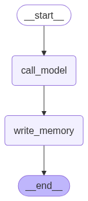

### Initial Agent Workflow

### Upgraded Agent Workflow

Still have to figure out how to delete the memories [Done]

### Agent Workflow with Delete Function

agentic_memory_app/
├── app.py                         # Streamlit entry point
├── config.py                      # Configs (e.g., paths, constants)
├── utils/
│   ├── memory_store.py            # Retrieve, store, delete memory logic
│   ├── prompts.py                 # Few-shot prompt templates
│   └── helpers.py                 # Any shared helper functions
├── nodes/                         # Core logic for each node
│   ├── personal_info_classifier.py        # Detect if personal info exists
│   ├── classify_add_or_delete.py         # Classify action: add/delete
│   ├── personal_info_extractor.py        # Extract info to be added
│   ├── personal_info_duplicate_classifier.py  # Is info already present?
│   ├── personal_info_storer.py           # Add to memory
│   ├── extract_delete_entity.py          # Extract entities to delete
│   ├── forget_logic.py                   # Delete specific info
│   ├── retrieve_memories.py              # Retrieve relevant memories
│   ├── log_personal_memory.py            # Save current session log
│   └── call_model.py                     # Final model call using all memory
├── data/
│   ├── memory.json                # Memory store (local or remote)
│   └── logs/                      # Optional logs of interactions
└── README.md
